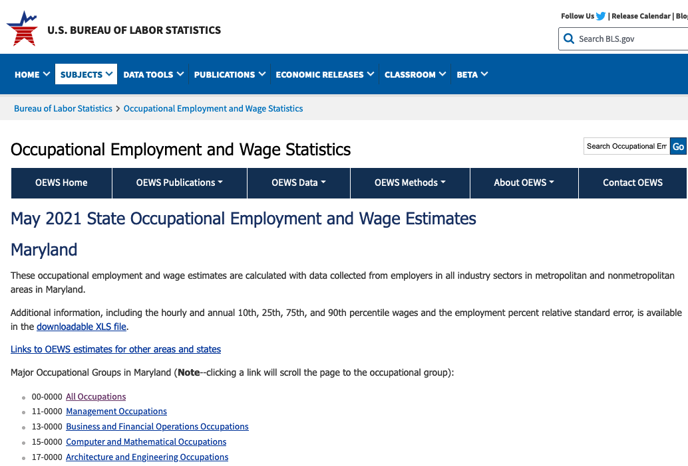
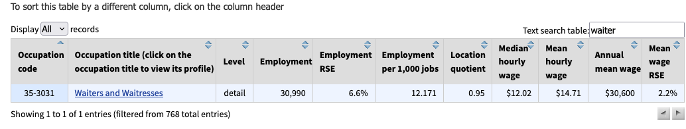
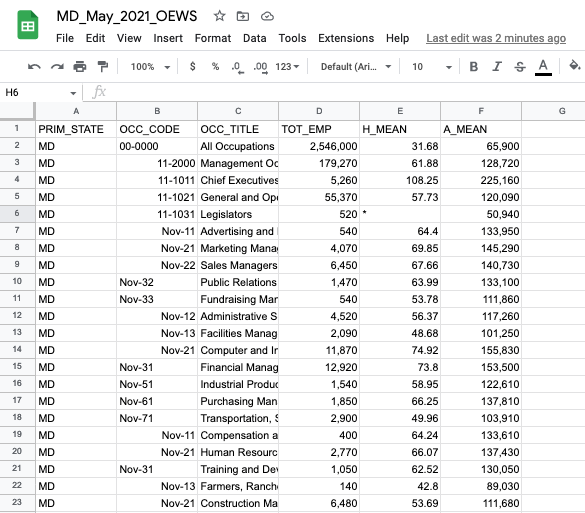
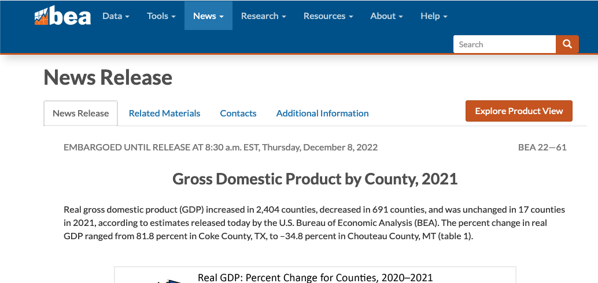
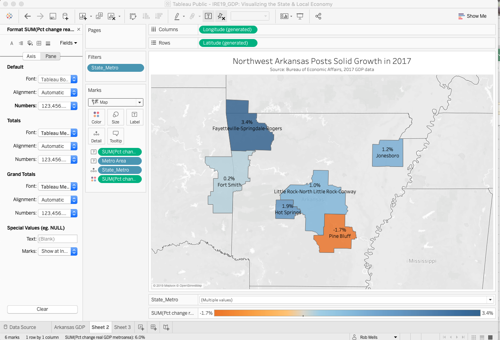

#### The Philip Merrill College of Journalism 
#### The Wall Street Journal
**Feb. 24, 2023**.  
    

**Today's Presentation**. 

> **<http://bit.do/XXXX>**

 

> **Presenter**
 
Rob Wells, Ph.D., Philip Merrill College of Journalism

**Co-Authors**   

- Jeannine Aversa, Bureau of Economic Analysis, Washington, DC

- Thomas Dail, Bureau of Economic Analysis, Washington, DC
 

 
 

> **Learning Outcome:**. 
 
You will learn to how to retrieve and analyze employment and regional GDP data for their own cities, counties or states and the steps to put it on a basic interactive charts. We will use Google Sheets and Datarapper.

   

 
---

# Storytelling with Employment Data

In this exercise, we will find out how much the typical engineer makes versus the typical journalist.

> [Check out the Maryland Occu[ational Employment and Wage Statistics GDP press release: "CNTL" + click for a New Tab](https://www.bls.gov/oes/current/oes_md.htm){target="_blank"}

   

 

Scroll down to the table, **use the search box and type in "waiter."** You'll see mean hourly wage for waiters in Maryland is ... ???

   

 

   

 
**Questions**:  

    What is the median hourly wage for Chief Executives?
    What is the annual mean wage for Gambling Dealers?
   

Let's work with the data ourselves. I've created a simplified version for this lesson that just focuses on Maryland

> [Download the Maryland Occupational Employment and Wage Statistics](https://docs.google.com/spreadsheets/d/1iA43WV1AOrOo8tUAKG2fZ45jdFO29tQL-WyHqUvgVS8/edit?usp=sharing){target="_blank"}

Open the file in Google Sheets.
It will look like this:

   

What do these columns mean? Look for the data dictionary or field descriptions. To save time, I downloaded in separately and put it here.

> [Look at field descriptions for Maryland Occupational Employment and Wage Statistics](https://docs.google.com/spreadsheets/d/1pUo9reCv6OvN87EZvFeHYJVN9qM57GeR/edit?usp=sharing&ouid=102324743793755798467&rtpof=true&sd=true){target="_blank"}

> Back to [the Maryland Occupational Employment and Wage Statistics.](https://docs.google.com/spreadsheets/d/1iA43WV1AOrOo8tUAKG2fZ45jdFO29tQL-WyHqUvgVS8/edit?usp=sharing){target="_blank"}

   

    1) Sort the sheet to find the highest and lowest hourly wage. Take a look at the list. What surprised you?
    
    2) The "All Occupations" entry summarizes the Maryland workforce. Find the average annual salary for all occupations. 
    Count how many occupations are below that average and how many above? 
    How could that be a story?
    
    3) Filter for journalists. 
    --Apply Filter to OCC_Code. 
    --Select Filter by Condition. 
    --Select Text contains. 
    --Type in "journalists" and apply
    How does that annual salary compare to the state average?
    How could that be a story?
    
    4) Examine the OCC_CODE column. The occupations ending in "0000" are occupational categories. Filter OCC_CODE for "0000" and examine the 23  occupational categories.
    --Apply Filter to OCC_Code. 
    --Select Filter by Condition. 
    --Select Text contains. 
    --Type in -0000 and apply
    You now will have a list of the 23 occupational categories
    Copy and paste the results on to a new sheet.
    --Select the results and copy
    --Click + icon at bottom left. A new blank sheet is created. Name it Occupations
    --Click at cell A1 and paste your results 
    How could this be a story?
    

# Step 2: Basic Interactive Chart

    

**Datawrapper Account**

Datawrapper creates great charts and maps in the cloud, which you can use to embed in your stories. There's no software to install on your computer.

I recommend you [create a Datawrapper account: "CNTL" + click for a New Tab](https://app.datawrapper.de/signin?ref=/#/signin){target="_blank"}

Or try Datawrapper [without an account: "CNTL" + click for a New Tab](https://app.datawrapper.de/create/chart){target="_blank"}

#### Create Chart On Datawrapper:

    1--Select "Create new" and select chart.
    2--Select "Connect Google Sheet" and paste URL from our Occupations sheet. Select "Proceed"
    3--Check and Describe, make sure all was imported correctly
    4--Visualize
        --Select Bar Chart
        --Select Refine Tab
            --Bars = A_Mean
            --Labels = OCC_TITLE
            --Show Values
              --Number format: Custom and paste in this into the box: $0.00]a
            --Sorting and Grouping
              --Select Reverse Order
            
        --Select Annotate Tab
            --Type in a headline, description, Data Source, link to original data and your byline. Click for social media sharing
     5--Click publish & Embed
    
<!--https://datawrapper.dwcdn.net/yU4Iu/1/--> 
    

<iframe title="Average Salaries for Maryland Occupations" aria-label="Bar Chart" id="datawrapper-chart-yU4Iu" src="https://datawrapper.dwcdn.net/yU4Iu/1/" scrolling="no" frameborder="0" style="width: 0; min-width: 100% !important; border: none;" height="778" data-external="1"></iframe>

  

 

# Step 3: Storytelling with Local GDP Data  

GDP tells us if the economy is great or if it sucks.

It's the **Big Daddy of economic indicators**.

What is Gross Domestic Product? It measures the value of all final goods and services produced in the country in a year. 

For example: that would be all of the stuff sold by Walmart and all of the beer sold by Liquor Barn and all of the gas pumped at Citgo, etc., AND A WHOLE LOT MORE, over a year.

You get the idea.

You can break it down to a state or a region, and also break it down into three month periods.

As a reporter, you can use local GDP data to figure out what business sectors are doing well and which ones stink. It can lead you to excellent stories.

This section will analyze the storytelling possibilities with the Gross Domestic Product by County data.  

> [Check out the local GDP press release](https://www.bea.gov/newsreleases/regional/gdp_metro/gdp_metro_newsrelease.htm){target="_blank"}

> Describe the data set  

Gross domestic product (GDP) by metropolitan area is the sub-state counterpart of the Nation's gross domestic product (GDP), the Bureau's featured and most comprehensive measure of U.S. economic activity. GDP by metropolitan area is derived as the sum of the GDP originating in all the industries in the metropolitan area.  

Contributions to growth are an industry's contribution to the state's overall percent change in real GDP. The contributions are additive and can be summed to the state's overall percent change. The statistics of GDP by metropolitan area released today are consistent with statistics of GDP by state.

GDP at chained volume measure is adjusted for the effect of inflation to give a measure of ‘real GDP’.

> Data limitations

This data series lags significantly. We are working with 2021 data, the most recent available. 

But it is still the best you can get and you can't beat the price.  
 
 
   

### Retrieve GDP Data 
 
  

 
  

> [Click here to download the Excel tables](https://www.bea.gov/sites/default/files/2022-12/lagdp1222.xlsx){target="_blank"}

You should have a file names "lagdp1222.xlsx" downloaded. Open it up.

 

> * Let's see what we have.   
    + One table of data.   
    + 3,223 rows with county data.    
    + GDP for four years, percentage change, and state ranking.
    
 
  
For this exercise, I cut down the table to Maryland only data. 

> [Maryland 2021 GDP](https://docs.google.com/spreadsheets/d/1UzdiXfGXGGcY3lokwxrLIs7HapXfz-2Uj0lBPTGA2z4/edit?usp=sharing){target="_blank"}

#### Walk through the GDP table:

Inflation adjusted GDP, chained to 2012.
Dollar amounts in thousands

This is cool because it has the percentage change growth, 2015/2016, and ranks it. 

Let's interrogate this table a bit.

    1--Sort counties according to total GDP in 2021
    2--Sort counties according to 2021_pct_rank_state 

Were you surprised to see the top county by GDP?
How are the lists different? 
What are some potential stories?

Next, look for the losers. Which counties saw declines in 2021 GDP? 

   
---

> **Question: What is the basic number for comparison with percentage GDP growth in 2021? In other words, what is the benchmark metric? **

<!--Answer: US 5.9% growth. Maryland, 4.6% growth Is your region above or below that benchmark?--> 

   

    

> Data limitations - weirdness

You may see a notation (D) in some cells. The footnote says: "(D) Not shown to avoid disclosure of confidential information, but the estimates for this item are included in the totals." What that means is this particularly industry is pretty small or has just a few dominant actors, so disclosure of the information would reveal confidential business information. Which is no fun whatsoever.

> Data Cleaning 

The Google sheet you have has been cleaned and modified so it will play well with Tableau. Basically, the BEA spreadsheet was cleaned to remove merged cells, states were split off into a new column, a data dictionary was created to keep track of our changes and new headers were created. 

Here is a [10-minute video](https://www.youtube.com/embed/5bS-GKvFzBk){target="_blank"} on how to do this yourself, using an older version of the data, which you can watch later.

 
   

### Build a GDP chart

> [Go to Datawrapper](https://app.datawrapper.de/signin?){target="_blank"}

    1--Select "Create new" and select chart.
    2--Select "Connect Google Sheet" and paste URL from our Maryland 2021 GDP sheet. Select "Proceed"
    3--Check and Describe, make sure all was imported correctly
      --Select Maryland and United States rows and delete
      --Select all columns EXCEPT 2021 and "Hide column from visualization"
    4--Visualize
        --Select Area Chart
        --Select Refine Tab
            --Bars = A_Mean
            --Labels = OCC_TITLE
            --Show Values
              --Number format: Custom and paste in this into the box: $(0,0.000)
            --Sorting and Grouping
              --Select Reverse Order
            
        --Select Annotate Tab
            --Type in a headline, description, Data Source, link to original data and your byline. 
            --Add text annotation to label Montgomery County's peak.
        --Layout Tab: Click for social media sharing
     5--Click publish & Embed

<!--https://datawrapper.dwcdn.net/p6oP9/1/--> 

<iframe title="Montgomery County Dominates Maryland's Economy" aria-label="Interactive area chart" id="datawrapper-chart-p6oP9" src="https://datawrapper.dwcdn.net/p6oP9/1/" scrolling="no" frameborder="0" style="width: 0; min-width: 100% !important; border: none;" height="719" data-external="1"></iframe>

# NOTES

* Deselect "All" so nothing is checked. Then search for the following and individually select:  

    + Fayetteville-Springdale-Rogers 
    + Fort Smith  
    + Hot Springs     
    + Jonesboro     
    + Little Rock-North Little Rock-Conway   
    + Pine Bluff     
    + U.S. metropolitan areas   
   

> You now have a GDP growth chart for the metro areas in Arkansas with a U.S. comparison. You can do the same with your state later on.   

---  

##Step 3: Basic Map

We'll use the same data for a map.
First, we have to convert the Dimension "Metro Area" to geographic data, or we need to "Geocode" this dimension. 

* Geocode Data
    + Click on "State_Metro" down arrow  
    + Select "Geographic Role" and then Select "CBSA/MSA" 
        - this converts the text of Metro Area into data for mapping.

Notice in Measures that Latitude and Longitude measures are now created. 

**Follow These Steps In This Order:**   

>* Click on "new worksheet" tab at lower left. It creates Sheet 2.    
  + Drag Longitude to Columns, Latitude to Rows    
  + In upper right "Show Me" menu, click on the map icon. A grayed out world map appears.    
  + Drag "State_Metro" to the sheet. A U.S. map appears with blue dots.   
  
  
>*  Filter "Metro Area" blue pill in the Marks formatting box next to the sheet.   Click "Show Filter" and format the filter as "multiple values dropdown" as we had in the past.
  + Deselect "All" so nothing is checked. Then select:    
       - Fayetteville-Springdale-Rogers     
       - Fort Smith, AR-OK   
       - Hot Springs       
       - Jonesboro       
       - Little Rock-North Little Rock-Conway      
       - Pine Bluff      
  
>  
  + Change "Automatic" in Marks Card. Click down arrow and select "Map." The blue metro areas will appear on the map.    
  + Drag from Measures "Percent Change in real GDP" to the worksheet.     
  + Bring up the data labels. Drag "Percent Change in real GDP" to Label box on  Marks card.     
  + Add Metro area names. Drag "Metro Area" to Label on Marks card. Click the Options box to allow labels to overlap    
  + Format labels, drag search box, legend to bottom, write a headline    

 
---
    

###**Your finished map should look like this:**  
 
 

 
---
* If you are good with this tutorial, then create a chart and map for your local community. Chart the rate of industry-specific sector growth by chooings one or more of the following:
    + Arts, entertainment, recreation, accommodation, and food services   
    + Construction  
    + Durable-goods manufacturing   
    + Educational services, health care, and social assistance   
    + Finance, insurance, real estate, rental, and leasing   
    + Government   
    + Information	 
    + Professional and business services 
    + Trade   
    + Transportation and utilities   
      
    

> [Use Tableau story for multiple perspectives. Here's an example of what you can do: "CNTL" + click for a New Tab](https://public.tableau.com/shared/THHKYTJC8?:display_count=yes&:origin=viz_share_link){target="_blank"}   

 
    

> **Story Function**  
> The story function allows you to compile all of these separate sheet into one visual, interactive narrative. 
> Click book icon in lower right to create a story.
> Add your various sheets to a story, creating one interactive graphic with multiple panels.

    
 

>  **Duplicate and Iterate.**    
  I built these multiple views by first formatting the first Arkansas sheet. Duplicate by left clicking on the sheet tab. Once copied, adjust the filter for your state or city. 
  You can zero in on specific items and build specific data visualizations for industries or cities.  
  Get the embed code from Tableau Public and add it to your blog or website.  
  
  
> Now, go experiment and figure out some other visualization!

> 

**Thank you.**  

>

###Follow up questions:   

- Rob Wells - rswells@uark.edu or @rwells1961  

To reach the Bureau of Economic Analysis:  
   
- Jeannine Aversa - Jeannine.Aversa@bea.gov    
   
- Thomas Dail - Thomas.Dail@bea.gov  
   
   

   

**--30--**

